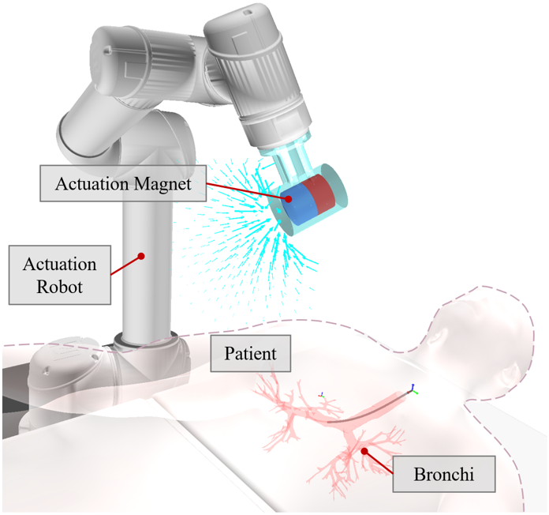
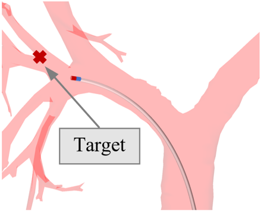
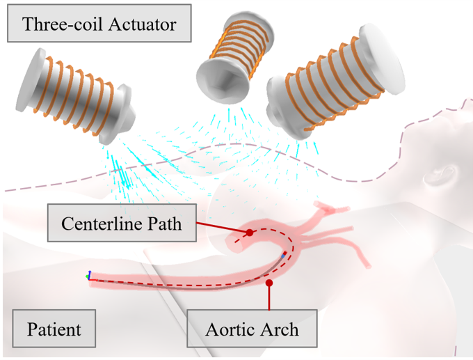
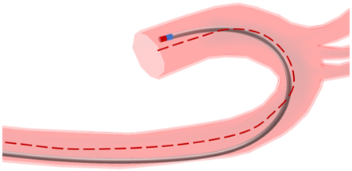
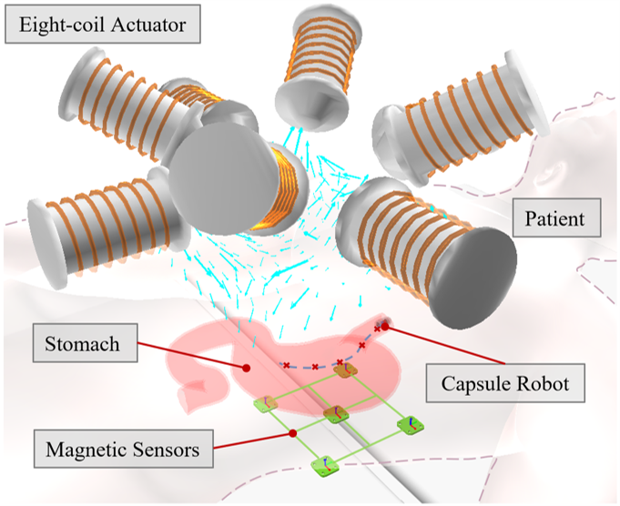
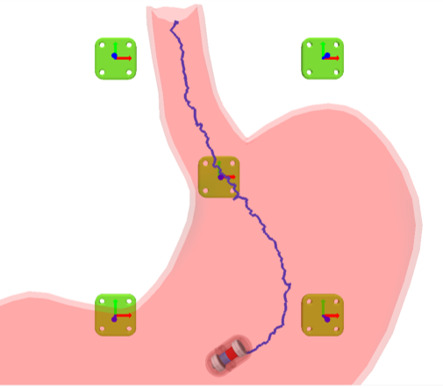

# MagRobot: An Open Simulation Platform for Magnetically Navigated Robots

[](https://arxiv.org/xxxxxxxxx)
[](https://www.youtube.com/xxxxxxxx)
[](https://www.gnu.org/licenses/gpl-3.0)

<!-- [English](./README.md) | [简体中文](./README_CN.md) -->

## Table of Contents

- [MagRobot: An Open Simulation Platform for Magnetically Navigated Robots](#magrobot-an-open-simulation-platform-for-magnetically-navigated-robots)
  - [Table of Contents](#table-of-contents)
  - [Overview](#overview)
    - [Project Description](#project-description)
  - [Key Features](#key-features)
  - [Main Project Structure](#main-project-structure)
  - [Installation Guide](#installation-guide)
    - [System Requirements](#system-requirements)
    - [Basic Environment Setup](#basic-environment-setup)
    - [Required Libraries](#required-libraries)
    - [Optional Libraries](#optional-libraries)
    - [Running Instructions](#running-instructions)
  - [Simulation Cases](#simulation-cases)
    - [Case 1: Bronchoscopy Navigation Experiment](#case-1-bronchoscopy-navigation-experiment)
      - [**Scene Description**](#scene-description)
      - [**Navigation Details**](#navigation-details)
      - [**Control Method:**](#control-method)
    - [Case 2: Endovascular Intervention Simulation](#case-2-endovascular-intervention-simulation)
      - [**Scene Description**](#scene-description-1)
      - [**Navigation Details**](#navigation-details-1)
      - [**Control Method:**](#control-method-1)
    - [Case 3: Magnetic Navigation Capsule Endoscopy Simulation](#case-3-magnetic-navigation-capsule-endoscopy-simulation)
      - [**Scene Description**](#scene-description-2)
      - [**Navigation Details**](#navigation-details-2)
      - [**Control Method:**](#control-method-2)
  - [License](#license)
  - [Citation](#citation)
  - [Contact Information](#contact-information)

## Overview

### Project Description
MagRobot is an open-source simulation platform developed based on the [SOFA Framework](https://www.sofa-framework.org/), specifically designed for magnetic navigation systems of miniature medical robots. The platform integrates various types of magnetic field physical models (including multi-electromagnet systems, permanent magnets, etc.) and dynamic models of multiple types of robots (such as continuum robots and capsule robots), capable of accurately simulating the motion behavior of various miniature medical robots under different magnetic field systems.

If you have any questions about the repository or the use of the simulator, please feel free to raise them in Issues.

<!--  -->


## Key Features
- **Cross-Platform Support**: MagRobot is a universal open-source simulation platform that supports operation on different operating systems (Linux, MacOS, Windows) and computing backends (CPU, GPU) to meet various computational needs
- **Multi-functional Simulation**: The platform supports simulation of magnetic drive and magnetic tracking tasks, suitable for both rigid and flexible robots, applicable to various medical applications (such as endoscopy, bronchoscopy, vascular intervention, etc.)
- **Physical Simulation Accuracy**: Through the SOFA framework, MagRobot achieves real-time simulation of high-fidelity robot-soft tissue interaction, including collision and friction force calculations, ensuring accurate simulation of robot motion and deformation
- **Open Development Environment**: Users can customize magnetic tracking and motion control algorithms through open interfaces, import third-party or custom geometric models, and export simulation data for cross-platform analysis
- **Efficient User Experience**: MagRobot provides a graphical user interface, supports standard simulation workflow (pre-processing, computation, post-processing), enabling users to efficiently design, visualize, and analyze magnetic navigation systems
- **Simulation Verification and Optimization**: The platform supports performance benchmarking of hardware configurations and algorithms, can connect to various input and display devices, assisting in the development and training of medical robot systems
- **Real-time Visualization and Data Export**: Simulation results can be visualized in real-time, including magnetic fields, force fields, 3D trajectories, etc., while supporting data export in CSV format for further analysis and processing

## Main Project Structure
```
MagRobot/                       # Root directory
├── bin/                        # Contains compiled executables and runtime dependencies
│   └── Release/                # Contains release version executables
│       └── MNSS.exe            # Main program executable
├── Config_Scene/               # Configuration files for different application scenarios
│   ├── Case1                   # Bronchoscopy navigation experiment configurations
│   ├── Case2                   # Endovascular intervention simulation configurations
│   └── Case3                   # Magnetic capsule endoscopy simulation configurations
├── demo_c/                     # Core functional modules and example code
│   ├── Control_Package         # Control algorithm package
│   ├── Data_Driven             # Data-driven related modules
│   ├── Environment_Package     # Environment models and physical simulation modules
│   ├── GUI_interface           # Graphical user interface related code
│   ├── Magnetic_Engine         # Magnetic field calculation and magnetic drive engine
│   ├── Manipulator_Kinematics  # Robot kinematics calculation module
│   ├── model                   # Model files and definitions
│   ├── Module_Package          # Functional module integration package
│   ├── Pose_Transform          # Pose transformation tools
│   ├── post_processing         # Data post-processing utilities
│   ├── Sofa_Interface          # SOFA framework interface
│   ├── State_Estimation        # State estimation module
│   ├── Trajectory_Package      # Trajectory planning module
│   ├── animate_controller.py   # Animation control script
│   ├── create_scene.py         # Scene creation utility
│   ├── field_show.py           # Magnetic field visualization
│   ├── hand_eye_calibration.py # Calibration utility
│   ├── main.py                 # Main program entry
│   ├── Monitor.py              # System monitoring
│   ├── path_controller.py      # Path control implementation
│   ├── position_estimate.py    # Position estimation
│   ├── post_processing.py      # Results processing
│   ├── record.py               # Data recording utility
│   ├── rotation_maxwell.py     # Maxwell equations solver
│   ├── simulator_setting.py    # Simulation parameters
│   └── 
├── lib/                        # Project required libraries and dependencies
└── README.md                   # Project documentation
```

## Installation Guide

### System Requirements
- Windows 7 or higher
- VRAM >= 4GB (recommended)
- RAM >= 8GB (recommended)

### Basic Environment Setup
1. Download and extract the software package (Note: path should not contain Chinese characters)
2. Install Python 3.8
   - Select "Add python to environment variables" during installation
   - If multiple python versions exist, set 3.8 as highest priority
   - When using conda environment, set `PYTHONHOME` environment variable

### Required Libraries
```bash
$ pip install numpy
$ pip install scipy
$ pip install keyboard
```

### Optional Libraries
Install other third-party libraries as needed:
```bash
$ pip install matplotlib
$ pip install pandas     
$ ...
```

<!-- ## Running Instructions
Launch software: Double-click `bin/Release/MNSS.exe` -->

### Running Instructions

The software is a pre-compiled version. To run it, follow these steps:

1. Navigate to the `bin/Release` directory.
2. Double-click the `MNSS.exe` file to launch the software. 

## Simulation Cases
### Case 1: Bronchoscopy Navigation Experiment

#### **Scene Description**

Bronchoscopy is an important medical tool for examining and treating lung diseases, and magnetic navigation technology can enhance its flexibility and navigation capabilities in complex airways. This simulation case simulates the navigation process of a magnetic navigation bronchoscope in segmental bronchi, demonstrating the impact of magnetic field on navigation performance.

#### **Navigation Details**



The bronchoscope is modeled as a 2mm continuum robot with a 0.03 A·m² magnet at its tip. An external 6-joint manipulator controls the magnetic field, initially set at 230 A·m². The environment includes main, lobar, and segmental bronchi. The robot navigates from the upper trachea to the target point, with a friction coefficient of 0.015 and a 2mm collision detection distance. 


Detailed configuration parameters have been saved in the [config_scene/case1](./config_scene/case1) folder.


#### **Control Method:**

**1. Manual navigation:**

   - **Insertion/retraction:**  
     * `CTRL + up/down`: Control insertion/retraction of the m-CR.

   - **Magnetic field direction:**
     * `CTRL + I/K`: Adjust inclination angle.
     * `CTRL + J/L`: Adjust azimuth angle.

**2. Automatic navigation:**

   - **Insertion/retraction:**  
     * `CTRL`: Control insertion/retraction of the m-CR.

   - **Magnetic field direction:**  
     * Automatic control via PID (Proportional-Integral-Derivative controller).


### Case 2: Endovascular Intervention Simulation

#### **Scene Description**



Magnetic navigation endovascular intervention is a minimally invasive medical technology that navigates flexible catheters through arteries and veins for diagnosing and treating vascular diseases. Compared to traditional open surgery, this technology offers advantages of smaller incisions, shorter hospital stays, and lower complication risks. This simulation demonstrates the catheter robot's navigation process in the aortic arch, showing the impact of electromagnetic coil configurations on magnetic navigation performance.


#### **Navigation Details**



In the simulation, a deformable geometric model of the aortic arch is used as the environment. The flexible catheter is modeled as a continuum robot with a permanent magnet of 0.04 A·m² magnetic moment embedded in its tip. An array of stationary electromagnets is used as the magnetic actuation source. The centerline of the aortic arch is extracted by the trajectory generator module, and the catheter robot follows this centerline at a constant advancement velocity of 35 mm/s.

Detailed configuration parameters have been saved in the [config_scene/case2](./config_scene/case2) folder.

#### **Control Method:**

Identical to the `Case 1`


### Case 3: Magnetic Navigation Capsule Endoscopy Simulation

#### **Scene Description**

Capsule endoscopy is a small, untethered device with built-in camera for examining digestive tract diseases. Compared to traditional tethered endoscopes, capsule endoscopy can reduce patient discomfort and reach target areas with higher precision. This simulation demonstrates the navigation process of capsule endoscopy in the gastrointestinal tract, showing the combined application of magnetic drive and magnetic positioning.




#### **Navigation Details**



The simulation uses a deformable anatomical model of the stomach. The capsule endoscope is modeled as a rigid-body robot with a permanent magnet for magnetic actuation. An array of eight stationary electromagnetic coils is used for actuation, and magnetic sensors are used for pose tracking. The simulation evaluates different sensor array configurations.

Detailed configuration parameters have been saved in the [config_scene/case3](./config_scene/case3) folder.


#### **Control Method:**

Click the  `Start` button to begin the simulation.


## License
Please note that this code was initially developed for research purposes and may undergo changes, with no warranty of fitness for any particular purpose. For commercial licensing, please contact: Prof. Heng Wang (wanghengscut@scut.edu.cn)

```
    This program is free software: you can redistribute it and/or modify
    it under the terms of the GNU General Public License as published by
    the Free Software Foundation, either version 3 of the License, or
    (at your option) any later version.

    This program is distributed in the hope that it will be useful,
    but WITHOUT ANY WARRANTY; without even the implied warranty of
    MERCHANTABILITY or FITNESS FOR A PARTICULAR PURPOSE.  See the
    GNU General Public License for more details.

    You should have received a copy of the GNU General Public License
    along with this program.  If not, see <https://www.gnu.org/licenses/>.
```

## Citation
If you use our simulation platform in your research, please cite our preprint paper:
```
@ARTICLE{rotortm2023,
  author={Heng Wang, Haoyu Song, Jiatao Zheng},
  journal={arXiv:xxx.xxx.xxx},
  title={MagRobot: An Open Simulation Platform for Magnetically Navigated Robots},
  year={2025},
  note={Preprint},
  url={https://arxiv.org/abs/xxx.xxx.xxx}}
```

## Contact Information

**Institution:** [South China University of Technology](https://www.scut.edu.cn/)

**Contacts:**
- Prof. Heng Wang (wanghengscut@scut.edu.cn)
- Haoyu Song (haoyusong_scut@xxx.com) 
- Jiatao Zheng (jtzheng_scut@163.com)