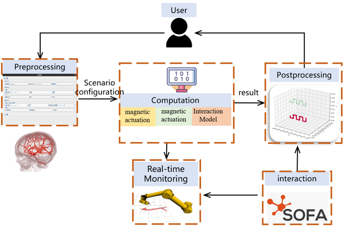
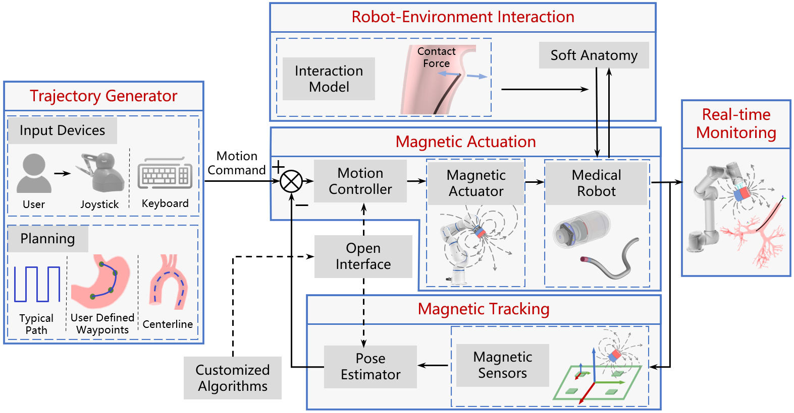
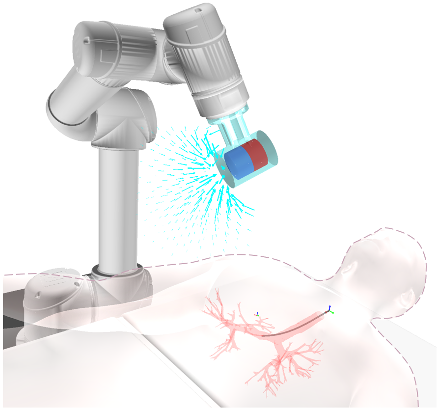
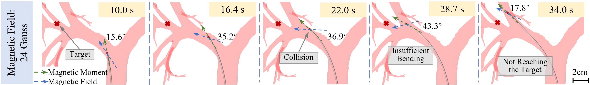
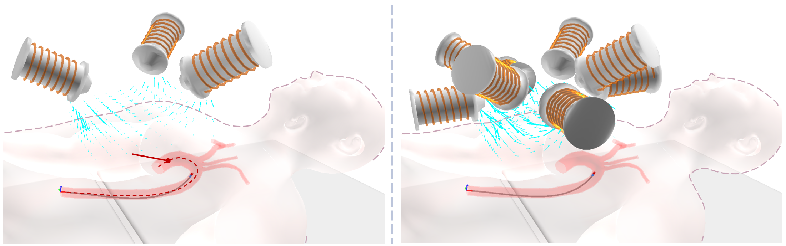
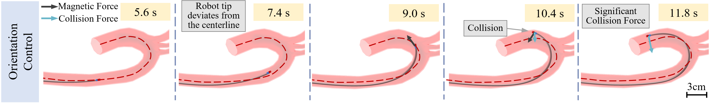
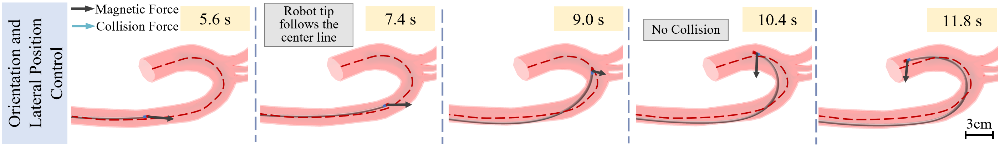
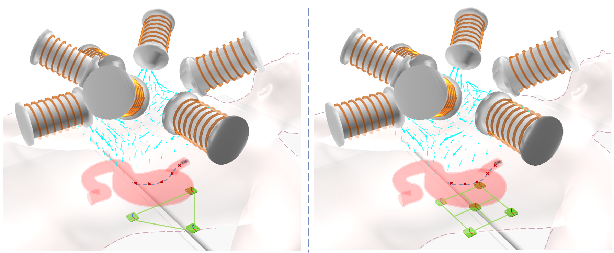
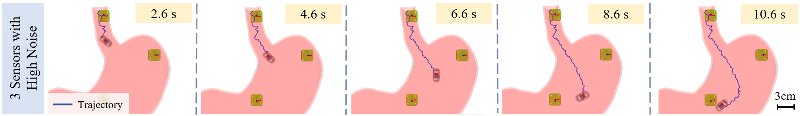
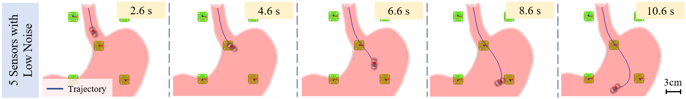

# MagRobot: An Open Simulation Platform for Magnetically Navigated Robots

[](https://arxiv.org/xxxxxxxxx)
[](https://www.youtube.com/xxxxxxxx)
[](https://www.gnu.org/licenses/gpl-3.0)

<!-- [English](./README.md) | [简体中文](./README_CN.md) -->

## Table of Contents

- [MagRobot: An Open Simulation Platform for Magnetically Navigated Robots](#magrobot-an-open-simulation-platform-for-magnetically-navigated-robots)
  - [Table of Contents](#table-of-contents)
  - [Overview](#overview)
    - [Project Description](#project-description)
  - [Key Features](#key-features)
  - [Project Structure](#project-structure)
  - [Installation Guide](#installation-guide)
    - [System Requirements](#system-requirements)
    - [Basic Environment Setup](#basic-environment-setup)
    - [Required Python Libraries](#required-python-libraries)
    - [Optional Modules](#optional-modules)
  - [Running Instructions](#running-instructions)
  - [Simulation Cases](#simulation-cases)
    - [Case 1: Bronchoscopy Navigation Experiment](#case-1-bronchoscopy-navigation-experiment)
      - [Case Description](#case-description)
      - [24Gs Magnetic Field Strength Experiment](#24gs-magnetic-field-strength-experiment)
        - [Simulation Results](#simulation-results)
      - [48Gs Magnetic Field Strength Experiment](#48gs-magnetic-field-strength-experiment)
        - [Simulation Results](#simulation-results-1)
    - [Case 2: Endovascular Intervention Simulation](#case-2-endovascular-intervention-simulation)
      - [Case Description](#case-description-1)
      - [Three-Coil Configuration](#three-coil-configuration)
      - [Eight-Coil Configuration](#eight-coil-configuration)
    - [Case 3: Magnetic Navigation Capsule Endoscopy Simulation](#case-3-magnetic-navigation-capsule-endoscopy-simulation)
      - [Case Description](#case-description-2)
      - [Three-Sensor Configuration (High Noise)](#three-sensor-configuration-high-noise)
      - [Five-Sensor Configuration (High Noise)](#five-sensor-configuration-high-noise)
      - [Five-Sensor Configuration (Low Noise)](#five-sensor-configuration-low-noise)
  - [License](#license)
  - [Citation](#citation)
  - [Contact Information](#contact-information)

## Overview

### Project Description
MagRobot is an open-source simulation platform developed based on the [SOFA Framework](https://www.sofa-framework.org/), specifically designed for magnetic navigation systems of miniature medical robots. The platform integrates various types of magnetic field physical models (including multi-electromagnet systems, permanent magnets, etc.) and dynamic models of multiple types of robots (such as continuum robots and capsule robots), capable of accurately simulating the motion behavior of various miniature medical robots under different magnetic field systems.

If you have any questions about the repository or the use of the simulator, please feel free to raise them in Issues.

<!--  -->



## Key Features
- **Cross-Platform Support**: MagRobot is a universal open-source simulation platform that supports operation on different operating systems (Linux, MacOS, Windows) and computing backends (CPU, GPU) to meet various computational needs
- **Multi-functional Simulation**: The platform supports simulation of magnetic drive and magnetic tracking tasks, suitable for both rigid and flexible robots, applicable to various medical applications (such as endoscopy, bronchoscopy, vascular intervention, etc.)
- **Physical Simulation Accuracy**: Through the SOFA framework, MagRobot achieves real-time simulation of high-fidelity robot-soft tissue interaction, including collision and friction force calculations, ensuring accurate simulation of robot motion and deformation
- **Open Development Environment**: Users can customize magnetic tracking and motion control algorithms through open interfaces, import third-party or custom geometric models, and export simulation data for cross-platform analysis
- **Efficient User Experience**: MagRobot provides a graphical user interface, supports standard simulation workflow (pre-processing, computation, post-processing), enabling users to efficiently design, visualize, and analyze magnetic navigation systems
- **Simulation Verification and Optimization**: The platform supports performance benchmarking of hardware configurations and algorithms, can connect to various input and display devices, assisting in the development and training of medical robot systems
- **Real-time Visualization and Data Export**: Simulation results can be visualized in real-time, including magnetic fields, force fields, 3D trajectories, etc., while supporting data export in CSV format for further analysis and processing

## Project Structure
```
MagRobot/
├── bin/
│   └── Release/
│       ├── MNSS.exe
│       └── Qt5WebEngineCore.dll
├── demo/
│   ├── Environment_Package/
│   └── Module_Package/
├── docs/
│   └── manual.docx
└── README.md
```

Main directory descriptions:
- `bin/`: Contains compiled executables and runtime dependencies
- `demo/`: Contains demo cases and example code
- `docs/`: Contains project-related documentation
- `Environment_Package/`: Provides various simulation environment models
- `Module_Package/`: Contains implementations of various functional modules

## Installation Guide

### System Requirements
- Windows 7 or higher
- VRAM >= 4GB (recommended)
- RAM >= 8GB (recommended)

### Basic Environment Setup
1. Download and extract the software package (Note: path should not contain Chinese characters)
2. Install Python 3.8
   - Select "Add python to environment variables" during installation
   - If multiple Python versions exist, set 3.8 as highest priority
   - When using conda environment, set `PYTHONHOME` environment variable

### Required Python Libraries
```bash
$ pip install numpy
$ pip install scipy
$ pip install keyboard
```

### Optional Modules
Install other third-party libraries as needed:
```bash
$ pip install matplotlib
$ pip install pandas     
# Other optional libraries...
```

## Running Instructions
1. Launch software: Double-click `bin/Release/MNSS.exe`
2. For detailed usage instructions, please refer to: `manual.docx`

## Simulation Cases
### Case 1: Bronchoscopy Navigation Experiment
#### Case Description
Bronchoscopy is an important medical tool for examining and treating lung diseases, and magnetic navigation technology can enhance its flexibility and navigation capabilities in complex airways. This simulation case simulates the navigation process of a magnetic navigation bronchoscope in segmental bronchi, demonstrating the impact of different magnetic field strengths on navigation performance.


#### 24Gs Magnetic Field Strength Experiment
In the initial simulation, a permanent magnet with a magnetic moment of 0.03 A·m² was embedded in the bronchoscope tip, navigated by an external magnetic field controlled by a six-joint robotic arm. The initial magnetic moment of the external magnet was 230 A·m², corresponding to a magnetic field strength of 24 Gauss.

##### Simulation Results
- The bronchoscope showed significant angle deviation during navigation, making it difficult to move along the target path
- Multiple collisions occurred, failing to reach the target position smoothly
- Experimental results indicate insufficient magnetic field strength, requiring optimization adjustments



#### 48Gs Magnetic Field Strength Experiment
To improve navigation performance, the external magnet's magnetic moment was increased to 700 A·m², corresponding to an increased magnetic field strength of 48 Gauss. The optimized magnetic navigation system significantly improved the bronchoscope's navigation performance.

##### Simulation Results
- The bronchoscope could smoothly navigate along the target path to the target position
- Angle deviation significantly reduced, fewer collisions occurred, greatly improving navigation accuracy and safety
- Experimental results verified the improvement in navigation performance with higher magnetic field strength


### Case 2: Endovascular Intervention Simulation

#### Case Description
Magnetic navigation endovascular intervention is a minimally invasive medical technology that navigates flexible catheters through arteries and veins for diagnosing and treating vascular diseases. Compared to traditional open surgery, this technology offers advantages of smaller incisions, shorter hospital stays, and lower complication risks. This simulation demonstrates the catheter robot's navigation process in the aortic arch, showing the impact of different electromagnetic coil configurations on magnetic navigation performance.



#### Three-Coil Configuration
The simulation used a three-coil electromagnetic drive system, which only controls the catheter tip direction. Simulation results show:

- The catheter can roughly move along the centerline trajectory, but due to lack of lateral position control, occasional large magnetic forces cause the catheter tip to deviate from the centerline and collide with vessel walls
- Maximum collision force reached 1.9 mN, potentially causing vessel damage



#### Eight-Coil Configuration
To address these issues, an improved eight-coil electromagnetic drive system was adopted, enhancing navigation accuracy through additional lateral position control. Simulation results show:

- The catheter tip can precisely move along the centerline trajectory, completely avoiding collisions
- Contact force between vessel and catheter remained zero, significantly improving navigation safety and performance



### Case 3: Magnetic Navigation Capsule Endoscopy Simulation

#### Case Description
Capsule endoscopy is a small, untethered device with built-in camera for examining digestive tract diseases. Compared to traditional tethered endoscopes, capsule endoscopy can reduce patient discomfort and reach target areas with higher precision. This simulation demonstrates the navigation process of capsule endoscopy in the gastrointestinal tract, showing the combined application of magnetic drive and magnetic positioning.



#### Three-Sensor Configuration (High Noise)
The simulation used three magnetic field sensors for positioning, combined with an eight-coil electromagnetic array to drive the capsule endoscope. Simulation results show:

- High sensor noise (40 mGauss) limited positioning accuracy
- Capsule endoscope trajectory deviated from target path, difficult to navigate precisely to target position
- Resulted in poor navigation performance and insufficient control stability



#### Five-Sensor Configuration (High Noise)
To further improve performance, sensor count was increased to five, but noise level remained at 40 mGauss. Simulation results show:

- Positioning error reduced compared to Case 1, navigation performance improved
- Capsule endoscope could follow predetermined path better, but trajectory still not smooth enough
- Noise presence limited navigation precision



#### Five-Sensor Configuration (Low Noise)
Using five sensors and optimizing the solution to reduce noise level to 8 mGauss further improved system performance. Simulation results show:

- Positioning accuracy significantly improved, position error reduced to 0.95 mm, orientation error to 9.86°
- Capsule endoscope trajectory smooth, precisely following predetermined path
- Achieved stable control, optimal navigation performance


## License
Please note that this code was initially developed for research purposes and may undergo changes, with no warranty of fitness for any particular purpose. For commercial licensing, please contact: Prof. Heng Wang (wanghengscut@scut.edu.cn)

```
    This program is free software: you can redistribute it and/or modify
    it under the terms of the GNU General Public License as published by
    the Free Software Foundation, either version 3 of the License, or
    (at your option) any later version.

    This program is distributed in the hope that it will be useful,
    but WITHOUT ANY WARRANTY; without even the implied warranty of
    MERCHANTABILITY or FITNESS FOR A PARTICULAR PURPOSE.  See the
    GNU General Public License for more details.

    You should have received a copy of the GNU General Public License
    along with this program.  If not, see <https://www.gnu.org/licenses/>.
```

## Citation
If you use our simulation platform in your research, please cite our preprint paper:
```
@ARTICLE{rotortm2023,
  author={Heng Wang, Haoyu Song, Jiatao Zheng},
  journal={arXiv:xxx.xxx.xxx},
  title={MagRobot: An Open Simulation Platform for Magnetically Navigated Robots},
  year={2025},
  note={Preprint},
  url={https://arxiv.org/abs/xxx.xxx.xxx}}
```

## Contact Information

**Institution:** [South China University of Technology](https://www.scut.edu.cn/)

**Contacts:**
- Prof. Heng Wang (wanghengscut@scut.edu.cn)
- Haoyu Song (haoyusong_scut@xxx.com) 
- Jiatao Zheng (jtzheng_scut@163.com)